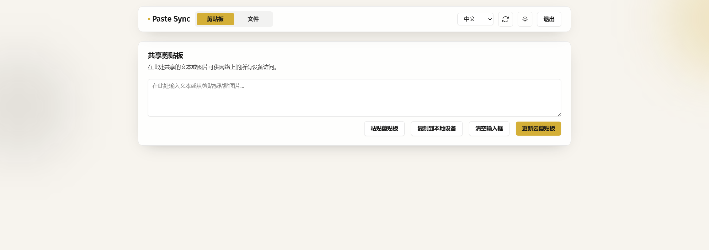
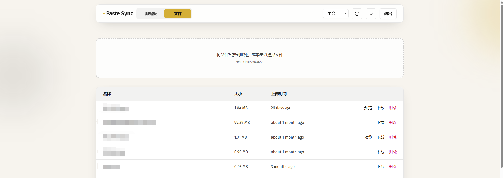
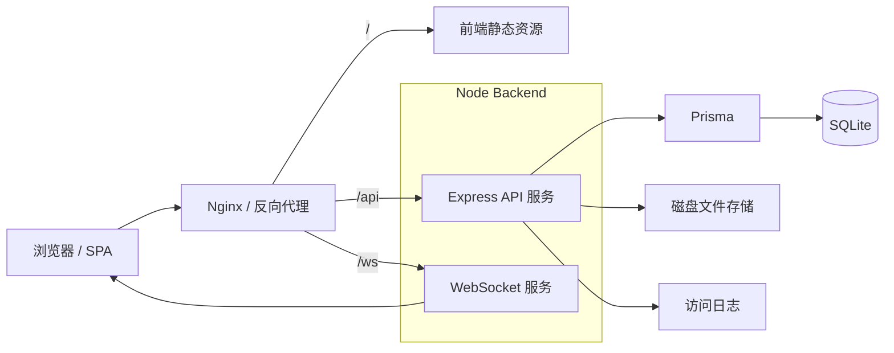

# Paste Sync

一个支持密码保护的剪贴板与文件共享应用，可在局域网内或通过公网反向代理，在自己的设备之间快速同步文本、剪贴板图片和文件。

[English README](./README.md)

## 界面展示

### 剪贴板



### 文件



## 架构图



## 功能特性

- **密码登录**：使用共享密码登录，服务端签发 7 天有效 JWT。
- **剪贴板同步**：支持文本与当前剪贴板图片的上传、查看和清空。
- **文件共享**：支持上传、下载、删除与图片预览。
- **传输进度**：显示上传/下载进度，并支持取消当前传输。
- **实时刷新**：通过 WebSocket 广播剪贴板和文件列表变更。
- **多语言与主题**：支持中文 / 英文，以及浅色 / 深色 / 跟随系统主题。
- **Docker 部署**：支持 Docker Compose 快速启动。

## 快速开始

### 环境要求

- Docker + Docker Compose，或
- Node.js 18+ + npm

### 安装

```bash
git clone https://github.com/AlakaSquasho/paste_sync.git
cd paste_sync
npm install
```

### Docker 运行

可以选择拉取已构建好的镜像部署，也可以直接从源码本地构建。

使用预构建镜像：

```bash
docker-compose -f docker-compose.image.yml up -d
```

本地构建：

```bash
docker-compose up -d --build
```

推荐保留两份 Compose 文件：`docker-compose.yml` 用于本地构建，`docker-compose.image.yml` 用于拉取预构建镜像。两者可以复用相同的端口、数据卷和环境变量，只需要把 `build` 换成 `image`。

访问：
- 前端：http://localhost:8080
- 后端：http://localhost:3000

### 本地开发

```bash
npm run dev
```

访问：
- 前端：http://localhost:5173（默认，可通过 `VITE_DEV_PORT` 修改）
- 后端：http://localhost:3000（默认，可通过 `PORT` 修改）

### 生产构建

```bash
npm run build
npm run start
```

## 认证与同步

- 登录接口：`POST /api/auth/login`
- REST 鉴权：`Authorization: Bearer <token>`
- WebSocket 鉴权：`/ws?token=...`
- 服务端广播 `clipboard_updated` 和 `files_updated` 事件，前端收到后重新拉取对应数据

## 数据与部署

- 数据库：SQLite（Prisma）
- 普通文件：`server/uploads/`
- 剪贴板图片：`server/uploads/clipboard/`
- 日志：`server/logs/`
- Docker 会持久化挂载数据库、uploads 和 logs

项目附带公网反代模板：`nginx.reverse-proxy.template.conf`。你可以通过自己的域名或 HTTPS 网关暴露应用；只要反向代理配置安全，使用场景不局限于局域网。

- `/` → `127.0.0.1:8080`
- `/api`、`/ws` → `127.0.0.1:3000`

如果设置了 `MAX_UPLOAD_SIZE_MB`，请同时保持外层 Nginx 的 `client_max_body_size` 一致。

## 配置项

可通过 `docker-compose.yml` 或 `.env` 配置：

- `PORT`：后端端口，默认 `3000`
- `DATABASE_URL`：SQLite 连接串
- `SHARED_PASSWORD`：共享密码，支持明文或 Bcrypt 哈希
- `JWT_SECRET`：JWT 签名密钥
- `LOG_DIR`：日志目录
- `IPINFO_API_KEY`：访问日志 IP 属地增强
- `MAX_UPLOAD_SIZE_MB`：上传大小限制，需与 Nginx 保持一致

生成密码哈希：

```bash
node -e "console.log(require('bcryptjs').hashSync('你的密码', 10))"
```

## 常用命令

```bash
npm run dev
npm run build
npm run start
npm run dev --workspace=client
npm run dev --workspace=server
```

## 技术栈

- 前端：React、TypeScript、Vite、Tailwind CSS、i18next
- 后端：Node.js、Express、Prisma、ws
- 数据库：SQLite
- 部署：Nginx、Docker Compose

## 开源协议

MIT
